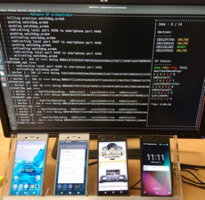

# PyMaO

PyMaO (**Py**thon **Ma**lware **O**rhestrator) is a tool that helps to orchestrate experiments involving Android applications and smartphones. PyMaO chains several analyses that are part of an experiment. An analysis is most of the time, a call to an external tool that returns a result, for example apktool, grep, Androguard, Apkid. An experiment is a collection of analyses that are run one by one, chained, if some conditions hold. For example, if the unpacking of an application with Apktool succeeds, then you can grep the code for searching a string. PyMaO has a nice old-fashion graphical interface (ncurses).

## News

- Nov. 19: We have pushed the source code online !
- Oct. 19: A demo of PyMaO will be presented at MASCOTS 2019
- Apr. 19: Pierre's student just started the development.

## Screenshots

[](documentation/PyMaO_4_smartphones_1.jpg)
[](documentation/PyMaO_4_smartphones_2.png)

## Publications

PyMaO has been first presented at the demo session of the conference MASCOTS 2019. You can find more information about this demo by looking at:

- the demo paper [Orchestrating Android Malware Experiments](https://hal-centralesupelec.archives-ouvertes.fr/hal-02305473) (IEEE)
- the [presentation slides](http://people.rennes.inria.fr/Jean-Francois.Lalande/talks/MASCOTS19-lalande.pdf)

If you use this software for your experiments, please cite the paper:

Jean-François Lalande, Pierre Graux, Tomás Concepción Miranda. Orchestrating Android Malware Experiments. MASCOTS 2019 - 27th IEEE International Symposium on the Modeling, Analysis, and Simulation of Computer and Telecommunication Systems, Oct 2019, Rennes, France. 


# Installation process

```bash
pip3 install -r requirements.txt
sudo apt install openjdk-8-jre-headless
sudo apt install apktool
sudo apt install python3-tk
```

Download the Android SDK, and unzip it in ~/Android/Sdk. Then:

```bash
cd ~/Android/Sdk/tools
./bin/sdkmanager --update
./bin/sdkmanager "platform-tools"
```

## Optional tool installation

Install APKiD (required for experiments that use Apkid analysis)

```bash
sudo pip3 install --upgrade wheel
sudo pip3 wheel --wheel-dir=/tmp/yara-python --build-option="build" --build-option="--enable-dex" git+https://github.com/VirusTotal/yara-python.git@v3.10.0
sudo pip3 install --no-index --find-links=/tmp/yara-python yara-python
sudo pip3 install apkid
```

# Usage

## Running PyMaO

```bash
python3 run.py config_file
```

Where config file is the configuratio of your experiment.

## Configuration file

A default config file config/default.ini is given as an example. 

There is three sections:

- [general]: it gives some general parameters about your devices, the temporary working directory, the debug level, etc.
- [xp]: it gives the parameters for your experiment such as inputs, outputs, etc.
- [analysis]: it gives special parameters for some analyses

The main parameters that you should override in the general section are the following:

```ini
[general]

# Controls the number of threads that you want to create
# Each thread executes the experiment for one APK
nb_workers=1

# Lists the UID of the Android devices to be used
# You should put more devices than the number of thread in the current implementation
devices=["CB512DXH1C", "CB512ENX66", "CB512FCYAS", "CB512FEL52","CB512DXGVS"]

# The TMPFS mount
# This temporary directory is used for manipulating files when doing an analysis. As the disk
# may be slow, PyMaO require that this folder is a TMPFS mount point.
# To achieve this, you can do:
# sudo mount -t tmpfs -o size=512M tmpfs /home/jf/swap/tmpfs/
# tmpfs=/Volumes/RAMDisk/tmpfs
# Note for mac user : you need first to create a ram disk (of size 1G) with the following command
# diskutil erasevolume HFS+ "RAMDisk" `hdiutil attach -nomount ram://2097152`
tmpfs=/home/jf/tmpfs

# As we need to communicate with devices, the path for the adb tool is required
sdkhome=/home/jf/Android/Sdk

# The debug level can be customized here.
debug = normal # For production
#debug = verbose # Prints messages logged with the call to log.debug and all called sub command
#debug = veryverbose # Prints messages logged with log.debugv, called sub commands and the output of these commands
```

The main parameters that you should override in the xp section are the following:

```ini
[xp]

# This is the name of the class of your experiment you want to run
targetXP=XPNative

# The input folder of the APK to analyze
apkbase="/home/jf/swap/malwaredebug"

# The folder where the output JSON files are generated, result of your experiment
jsonbase="/home/jf/swap/malwaredebug"
```

The apkbase and jsonbase parameters can be lists, if you have several datasets to analyze:

```ini
apkbase=["/dataset1","/dataset2"]
jsonbase=["/dataset1/json","/dataset2/json"]
```

## Writting an experiment

Experiments files are located in the folder experiment. An experiment is a class that extends Experiment and is coded in the constructor __init__. In this constructor, we append in the field self.analyses all the analysis that should run. We also express the condition between two analyses. For example, the following is an extract of XPExampleModel:

```python
  def __init__(self, deviceserial=None):
        self.deviceserial = deviceserial
        self.analyses = []

        # Analysis ManifestDecoding
        # - always gives self as a parameter to an Analysis
        # - None are the preconditions
        self.analyses.append((ManifestDecoding(self),None))

        # Run Unzip
        # - No preconditions
        self.analyses.append((Unzip(self), None))

        # Run GetManifAndDexDates
        # - Here the precondition is encoded as an array, containing a dictionary with:
        #   - as key, one of the previous analysis (here Unzip)
        #   - as value, the expected value
        self.analyses.append((GetManifAndDexDates(self),
                            [{"Unzip":{"status": "done"}}]))

```
It expresses that:

- ManifestDecoding analysis should be done
- Unzip analysis should be done
- GetManifAndDexDates should be done if the Unzip analysis has status "done"


## Post-Processing

Basic usage:
    
    python3 post_processing/PostProcessing.py <json_config_file>


where:

`json_config_file`: The file that holds the definitions of the rows and columns to be processed

For more information about the usge of PostProcessing.py, check the help with:

    python3 post_processing/PostProcessing.py -h

Example of config file:

see `post_processing/examples/drebin.json`

    {
        "rows":{
            "Dataset 1":"/path/to/dataset/1",  ----> Directories that contain JSON
            "Dataset 2":"/path/to/dataset/2",        files generated by the orchestrator
            "Dataset 3":"/path/to/dataset/3",
        },
        "columns":{
            "Column 1":[
                "<boolean expression with JSONPath>",
                null        ---------------------------> No special porcentage is done
            ],
            "Column 2":[
                "<boolean expression with JSONPath>",
                null
            ],
            "Column 3":[
                "<boolean expression with JSONPath>",
                "Column 2"               ------------> Porcentage in relation to Column 2,
            ]                                          which MUST be declared before
        },
        "histograms":{
            "Data 1":[
        			"<JSONPath expression>",
        			"<type>"             ---------------> This can be date only (for the moment)
        		],
        		"Data 2":[
        			"<JSONPath expression>",
        			"<type>"
        		]
        },
        "output_dir":"/path/to/your/output/dir"
    }


The JSONPath implementation is from (https://github.com/h2non/jsonpath-ng)

The boolean expression parser implementation is from (https://gist.github.com/leehsueh/1290686)

It follows this grammar:

    Expression --> Terminal (>,<,>=,<=,==) Terminal
    Terminal --> Number or String or Variable

To compare a variable to a string, they must be enclosed in `""` in the JSON file. For example:

    $..Unzip.status == \"done\"

This expression compares if the variable `$..Unzip.status` is equal to the string `done`.

For our purposes, all the JSONPath expressions are variables.

### TODO:
* [x]  Handle top and bottom surveys
* [ ]  Handle non-dates histograms (little patch)
* [ ]  Expand expression for multiple requests
* [ ]  Add reference in histogram to defined columns
